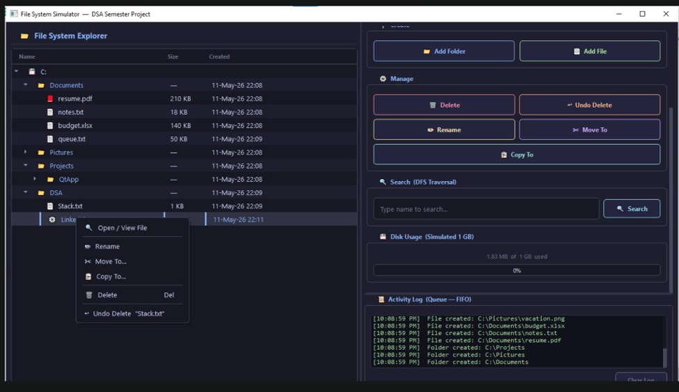
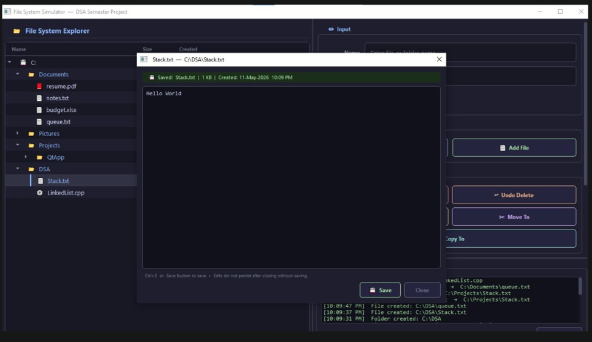
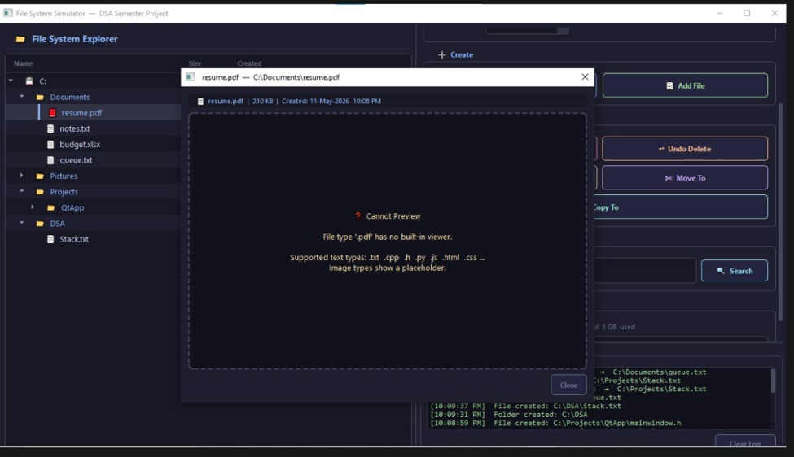

  <h1>File System Simulator</h1>
  
<b>A C++ and Qt GUI application simulating operating system file management through core Data Structures.</b>

<h2>Overview</h2>

  Modern operating systems use complex file management systems to organize and store files efficiently. 
  This project simulates an internal file system using fundamental Data Structures, such as <b>Trees, Stacks, Queues, and Depth-First Search (DFS)</b> providing a graphical interface to perform standard file and directory operations interactively.

<h2 align="center">Application Screenshots</h2>

  
  
  

<h2>How the Project Works</h2>

  The simulator models directory organization and background system mechanics using specific data structures:

<ul>
  <li>
    <b>Hierarchical Directory Management (N-ary Tree):</b>
    Directory organization is structured as a tree. Creating, moving, copying, or renaming folders updates pointer links and subtrees without losing file metadata.
  </li>
  <li>
    <b>Recycle Bin & Undo System (Stack - LIFO):</b>
    Deleting files or folders moves them to a Recycle Bin implemented with a Stack. Performing an <i>Undo Delete</i> pops the latest item from the stack and restores it to its original location.
  </li>
  <li>
    <b>Activity Logging (Queue - FIFO):</b>
    User actions (creating, deleting, renaming, moving) are recorded sequentially into an Activity Log using a Queue, displaying oldest actions first.
  </li>
  <li>
    <b>File Search (Depth-First Search - DFS):</b>
    Searching for files or folders traverses the tree hierarchy using DFS to locate paths across all subdirectories.
  </li>
  <li>
    <b>Real-Time Disk Tracking:</b>
    Monitors used vs. total disk capacity, updating automatically whenever files are added, modified, or deleted.
  </li>
</ul>

<h2>Key Features</h2>
<table>
  <tr>
    <th>Feature</th>
    <th>Description</th>
  </tr>
  <tr>
    <td><b>Folder & File Creation</b></td>
    <td>Create directories and files with custom names, extensions, and metadata (size, timestamp).</td>
  </tr>
  <tr>
    <td><b>File Operations</b></td>
    <td>Rename, copy, and move files or folders across directories.</td>
  </tr>
  <tr>
    <td><b>Built-In File Editor</b></td>
    <td>Read, edit, and save text content directly within the application using a text editor.</td>
  </tr>
  <tr>
    <td><b>Context Menu & History</b></td>
    <td>Right-click shortcut menus and quick access to the last 5 recently opened files.</td>
  </tr>
  <tr>
    <td><b>Properties View</b></td>
    <td>View file metadata including creation date, size, name, and type.</td>
  </tr>
</table>

<h2>Tech Stack</h2>
<ul>
  <li><b>Language:</b> C++</li>
  <li><b>GUI Framework:</b> Qt Framework</li>
  <li><b>Core Data Structures:</b> Trees, Stacks, Queues, Graphs/Traversals (DFS)</li>
</ul>